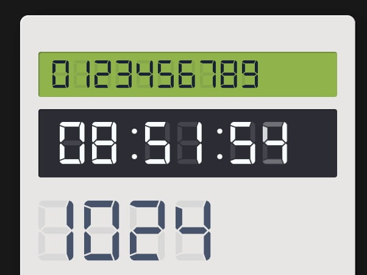

# Vue 3 Seven Segment Display
Modern lightweight Vue 3 seven segment display.

[Preview Demo & Docs](https://bh-lay.github.io/vue3-seven-segment-display/index.html)




## Getting started

### Installation

First step is to install it using `yarn` or `npm`:

```bash
npm install vue3-seven-segment-display

# or use yarn
yarn add vue3-seven-segment-display
```

### Basic Using

```typescript
import SevenSegmentDisplay from 'vue3-seven-segment-display'

const app = createApp(App)
app.use(SevenSegmentDisplay as Plugin)
```

or

```vue
<template>
  <seven-segment-display :value="3421" />
</template>

<script>
import { SevenSegmentDisplay } from 'vue3-seven-segment-display'

export default {
  name: 'App',
  components: {
    SevenSegmentDisplay
  },
}
</script>
```

## Style Custom
You only need to use CSS to customize, and use `font-size` and `color` as normal text.

## Props
| Prop | Descriptoion | Type | Default |
| ---- | ---- | ---- | ---- |
| value | Number displayed on the screen. Must be integer or String in integer form. | String, Number | undefined |
| disable-select | Forbidden user select behavior. | Boolean | false |

